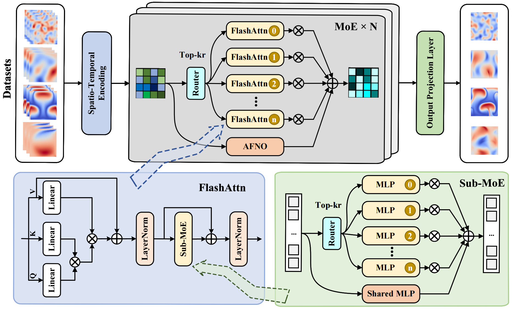
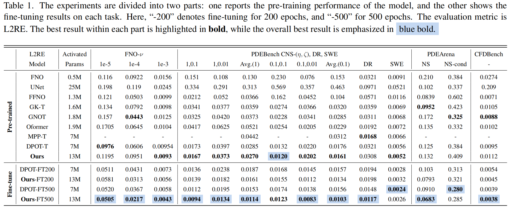

## NESTOR: A Nested MOE-based Neural Operator for Large-Scale PDE Pre-Training
You can find the paper here: [NESTOR: A Nested MOE-based Neural Operator for Large-Scale PDE Pre-Training](https://arxiv.org/abs/2602.22059)


Our pre-trained NESTOR achieves the state-of-the-art performance on multiple PDE datasets and could be used for finetuning on different types of downstream PDE problems.



### Usage 

##### Dataset Protocol

All datasets are stored using hdf5 format, containing  `data`  field. Some datasets are stored with individual hdf5 files, others are stored within a single hdf5 file.

In `data_generation/preprocess.py`,  we have the script for preprocessing the datasets from each source. Download the original file from these sources and preprocess them to `/data` folder.

| Dataset       | Link                                                         |
| ------------- | ------------------------------------------------------------ |
| FNO data      | [Here](https://drive.google.com/drive/folders/1UnbQh2WWc6knEHbLn-ZaXrKUZhp7pjt-) |
| PDEBench data | [Here](https://github.com/pdebench/PDEBench/blob/main/pdebench/data_download/pdebench_data_urls.csv) |
| PDEArena data | [Here](https://huggingface.co/pdearena/datasets)   |
| CFDbench data | [Here](https://huggingface.co/datasets/chen-yingfa/CFDBench) |
| Poseidon data | [Here](https://huggingface.co/collections/camlab-ethz/poseidon-downstream-tasks) |
| ERA5 data | [Here](https://dataserv.ub.tum.de/s/m1524895) |

In `utils/make_master_file.py` , we have all dataset configurations. When new datasets are merged, you should add a configuration dict. It stores all relative paths so that you could run on any places. 


##### Single GPU Pre-training

```python
python train_temporal.py
# or
python trainer.py --config_file finetune.yaml
```

##### Multiple GPU Pre-training

```python
python parallel_trainer.py --config_file pretrain_tiny.yaml
```

##### Configuration file

Now I use yaml as the configuration file. You could specify parameters for args. If you want to run multiple tasks, you could move parameters into the `tasks` ,

```yaml
model: Nestor
width: 512
tasks:
 lr: [0.001,0.0001]
 batch_size: [256, 32] 
```

This means that you start 2 tasks if you submit this configuration to `trainer.py`. 

##### Requirement

Install the following packages via conda-forge

```bash
conda install torch==2.3.1
conda install torchvision==0.18.1
conda install torchaudio==2.3.1
conda install timm==0.9.7
conda install einops==0.7.0
conda install numpy==1.24.4
conda install scipy==1.9.1
conda install pandas==1.4.4
conda install matplotlib==3.5.2
conda install scikit-learn==1.0.2
conda install scikit-image==0.19.2
conda install h5py==3.7.0
conda install PyYAML==6.0.1
conda install tensorboard==2.14.1
conda install tqdm==4.66.4 
```

### Code Structure

- `README.md`
- `train_temporal.py`: main code of single GPU pre-training auto-regressive model 
- `trainer.py`: framework of auto scheduling training tasks for parameter tuning
- `parallel_trainer.py` framework of auto scheduling training tasks for Mutil-GPU
- `train_temporal_parallel.py`main code of Mutil-GPU pre-training auto-regressive model 
- `expert_preferences`code for analyzing dataset preferences of experts
- `utils/`
  - `criterion.py`:  loss functions of relative error
  - `griddataset.py`: dataset of mixture of temporal uniform grid dataset
  - `make_master_file.py`: datasets config file
  - `normalizer`: normalization methods
  - `optimizer`: Adam/AdamW/Lamb optimizer supporting complex numbers
  - `utilities.py`: other auxiliary functions
  - `visualize_predictions.py`: Visualize the model predictions and ground truth for each channel
- `configs/`: configuration files for pre-training, evaluate or fine-tuning
- `models/`
  - `nestor.py`:        NESTOR model
  - `nestor_vis.py`:    Visualize token-level MoE heatmaps of the NESTOR model
  - `dpot.py`:          DPOT model
  - `moepot.py`:        MoEPOT model
  - `moe_conv.py`:      moe model within MoEPOT
  - `fno.py`:           FNO with group normalization
  - `mlp.py`

  ### Acknowledgements
  We would like to thank the following open-source projects and research works: [DPOT](https://github.com/HaoZhongkai/DPOT) for model architecture, [Poseidon](https://github.com/camlab-ethz/poseidon) for dataset


