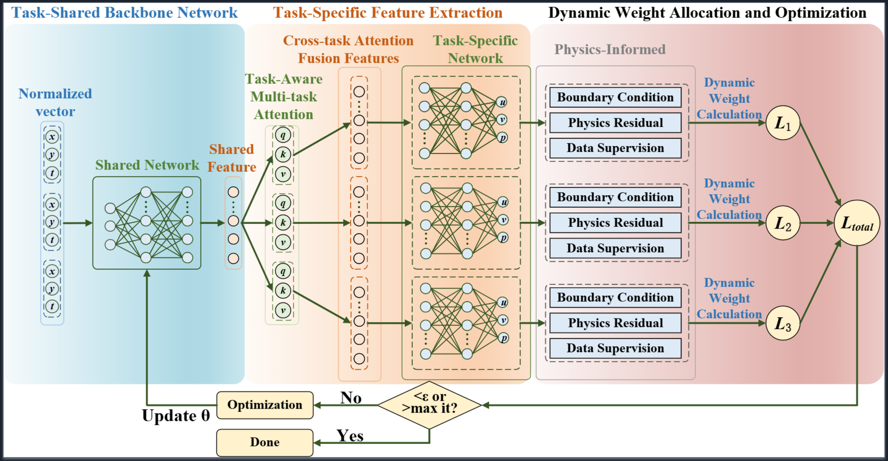

## UniPINN

**UniPINN: A Unified PINN Framework for Multi-task Learning of Diverse Navier–Stokes Equations**  
Dengdi Sun, Jie Chen, Xiao Wang*, Jin Tang  

---

### Abstract

Physics-Informed Neural Networks (PINNs) have shown promise in solving incompressible Navier–Stokes equations, yet existing approaches are predominantly designed for single-flow settings. When extended to multi-flow scenarios, these methods face three key challenges: (1) difficulty in simultaneously capturing both shared physical principles and flow-specific characteristics, (2) susceptibility to inter-task negative transfer that degrades prediction accuracy, and (3) unstable training dynamics caused by disparate loss magnitudes across heterogeneous flow regimes. To address these limitations, we propose UniPINN, a unified multi-flow PINN framework that integrates three complementary components: a shared-specialized architecture that disentangles universal physical laws from flow-specific features, a cross-flow attention mechanism that selectively reinforces relevant patterns while suppressing task-irrelevant interference, and a dynamic weight allocation strategy that adaptively balances loss contributions to stabilize multi-objective optimization.

---

### Framework


<p align="center">
  
</p>

---

## Stage Release

At this stage, this repository **only provides the core training and model implementation used in the paper**, in order to expose the full training pipeline and method details.  
The complete project code (including additional experiment scripts, utilities, and full reproducibility details) will be released after the paper is accepted.

### Currently released core code

- `core_code/train.py`: unified training/testing entry (`joint` / `single`), including cross-flow DWA, adaptive component weights, and the full training/testing loop
- `models/pinn.py`: physics-informed loss for Navier–Stokes (momentum residuals, divergence constraint, boundary losses, and optional data-supervision terms)
- `models/network.py`: shared–specialized architecture with cross-flow attention (self + cross), task embeddings, and periodic feature enhancement

---

## Data

The training and testing data are generated from high-fidelity numerical solutions provided by **PDEBench** (no data files are included in this repository).  
Before running, please set the following in `core_code/config.py`:

- `PREPROCESSED_DIR = "<absolute path to your preprocessed data>"`
- `USE_PREPROCESSED_DATA = True`


---

## Get Started

### Set up the environment

```bash
conda create -n unipinn python=3.10 -y
conda activate unipinn

# Install PyTorch (choose CPU or GPU build as appropriate for your machine)
pip install "torch>=2.0.0"

cd core_code
pip install -r requirements.txt
```

### Quick Start

In the `core_code/` directory:

```bash
# Multi-flow joint training (recommended)
python train.py --phase train --train-mode joint

# Single-flow training (example: lid_driven_cavity)
python train.py --phase train --train-mode single --flow lid_driven_cavity

# Test on an existing experiment directory (exp_dir is a timestamped folder produced by training)
python train.py --phase test --exp-dir path/to/exp_dir
```

